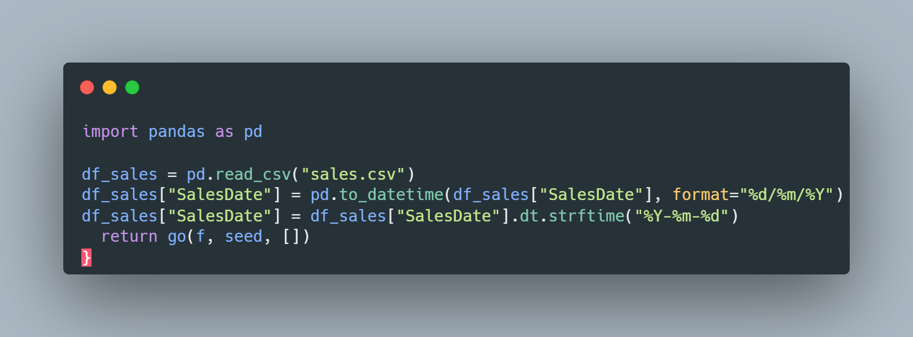

<h1 align="center">
  <br />
  
  <br />
  <b>Chat Custom Sales Insights</b>
  <br />
  <sub><sup><b>(GROCERY SALES)</b></sup></sub>
  <br />
  <a href="#">
    
  </a>
  <a href="#">
    
  </a>
</h1>

<p align="center">
  Seja muito bem-vindo(a) ao **Chat Custom Sales Insights**! Este projeto nasceu da ideia de utilizar um conjunto de dados de um **supermercado fictício** para obter insights e gerar relatórios de vendas. Aqui, o chat customizado, criado no ChatGPT, será capaz de analisar os datasets e responder perguntas específicas, sempre com muita empolgação e clareza.
  
  Neste repositório, você encontrará instruções para configurar o ambiente, preparar os dados e explorar as análises de vendas.
</p>

---

## Sumário

1. [Contexto](#contexto)  
2. [Datasets](#datasets)  
3. [Pré-requisitos](#pré-requisitos)  
4. [Perguntas](#perguntas)  
5. [Técnicas Utilizadas](#técnicas-utilizadas)  
6. [Dependências](#dependências)  
7. [Estrutura](#estrutura)
8. [Como Utilizar](#como-utilizar)  
9. [Exemplo de Metáfora](#exemplo-de-metáfora)  
10. [Referências](#referências)  
11. [Autor](#autor)  
12. [Licença](#licença)

---

## Contexto

Imagine seus dados de vendas como peças de um grande quebra-cabeça. Quando colocamos as peças corretas juntas (neste caso, ao preparar, limpar e analisar os dados), conseguimos enxergar o todo com mais clareza e descobrir padrões e tendências, ou seja, os **insights de vendas** que fazem toda a diferença para a tomada de decisões.

### Resumo do Projeto

- **Fonte dos dados**: [Kaggle - Grocery Sales Dataset](https://www.kaggle.com/datasets/andrexibiza/grocery-sales-dataset)  
- **Amostra Utilizada**: Em vez de utilizar o dataset completo (>1 milhão de entradas), optou-se por uma versão reduzida com 5 mil entradas (removendo ~1% de dados faltantes do dataset original).  
- **Período**: De `2018-01-01` a `2018-05-09` (formato yyyy-mm-dd).  
- **Objetivo**: Permitir que um chat customizado gere insights (por exemplo, desempenho de vendas por mês, categorias e regiões) de forma interativa.

---

## Datasets

| Dataset          | Arquivo          | Descrição                                                         |
|------------------|------------------|-------------------------------------------------------------------|
| **Categorias**   | `categories.csv` | Lista de categorias de produtos                                   |
| **Cidades**      | `cities.csv`     | Informações sobre as cidades                                      |
| **Países**       | `country.csv`    | Dados sobre o(s) país(es)                                         |
| **Clientes**     | `clients.csv`    | Informações dos clientes                                          |
| **Funcionários** | `employees.csv`  | Dados dos funcionários responsáveis pelas vendas                  |
| **Produtos**     | `products.csv`   | Catálogo de produtos (vinculados às categorias)                   |
| **Vendas**       | `sales.csv`      | Dados de vendas (datas, quantidades, preços, etc.)               |

---

## Pré-requisitos

1. **Chat customizado**: Se você tiver uma assinatura paga do ChatGPT, você pode criar um chat customizado para executar as consultas para os insights. Caso você não possua um, há a possibilidade de usar o ChatGPT (ou qualquer chat de IA) para anexar os datasets e realizar as consultas. Lembre-se que há uma limitação de números de consultas em chats sem assinatura.
2. **Padronizar formato de datas**: Garanta que a coluna `SalesDate`, do dataset "sales.csv", esteja no formato `yyyy-mm-dd`.
3. **Ferramenta de Análise**: Você pode usar Python, R ou qualquer outra tecnologia (Power BI, Excel, etc.) para leitura e tratamento dos arquivos CSV.

Exemplo em Python:

<br />

<br />

## Perguntas

Para facilitar a execução das análises, aqui vai uma lista de comandos que você pode realizar com o chat ou com sua ferramenta de análise preferida. Pense neles como cartas mágicas que você pode lançar para obter diferentes visões do seu conjunto de dados:

| Pergunta / Comando                                                                               | Descrição                                                                                                        |
|---------------------------------------------------------------------------------------------------|------------------------------------------------------------------------------------------------------------------|
| **Calcule as vendas totais do mês de janeiro**                                                    | Retorna o total de vendas (soma de valores) referente a janeiro de 2018.                                         |
| **Calcule as vendas totais de cada mês**                                                          | Exibe um resumo com a soma das vendas agrupadas por mês.                                                         |
| **Comparar o desempenho de vendas em diferentes categorias de produtos a cada mês**               | Permite analisar quais categorias vendem mais em cada período do ano.                                            |
| **Compare o desempenho através de gráficos**                                                      | Gera (ou sugere) representações visuais (barras, linhas, pizza) para ilustrar as comparações de desempenho.      |
| **Classifique os produtos com base na receita total de vendas**                                   | Classifica cada produto (do mais vendido ao menos vendido) conforme sua receita total.                           |
| **Analisar a quantidade de vendas e a receita para identificar produtos de alta demanda**         | Identifica os “carros-chefes” que apresentam maiores quantidades vendidas e maior valor de receita.              |
| **Segmentar os clientes com base na frequência de compra e no gasto total**                       | Agrupa clientes em “clusters” (ex.: alto gasto, compra frequente) para estratégias específicas de marketing.     |
| **Mapear os dados de vendas para cidades e países específicos para identificar regiões de alto desempenho** | Apresenta quais locais geram maiores volumes de vendas.                                                          |
| **Comparar volumes de vendas entre diversas áreas geográficas**                                    | Mostra a distribuição de vendas para cada cidade, estado ou país, permitindo comparar regiões entre si.          |
| **Compare agora por cidades**                                                                     | Foca especificamente na comparação de vendas ao nível das cidades listadas no dataset.                           |

Sinta-se livre para combinar essas perguntas e criar **análises ainda mais ricas**!

---

## Técnicas Utilizadas

- **Pandas**: Biblioteca essencial para manipulação, limpeza e análise de dados
  em Python.
- **Visualização de Dados**: Uso de bibliotecas como `matplotlib` ou `plotly`
  para criar gráficos que facilitem a interpretação dos insights.
- **Modelagem de Dados**: Organização das tabelas (CSV) em um formato relacional,
  para tornar a consulta mais eficiente e coerente.

---

## Dependências

| Pacote          | Versão  | Link                                                  |
|-----------------|---------|------------------------------------------------------|
| `pandas`        | 1.3+    | [Docs](https://pandas.pydata.org/docs/)             |
| `matplotlib`    | 3.4+    | [Docs](https://matplotlib.org/stable/contents.html) |
| `plotly`        | 5.0+    | [Docs](https://plotly.com/python/)                  |
| `python`        | 3.8+    | [Site](https://www.python.org/)                     |

---

## Estrutura

```
chatgpt_custom_sales_insights
├── data
│   ├── raw_data
│   │   ├── categories.csv
│   │   ├── cities.csv
│   │   ├── country.csv
│   │   ├── clients.csv
│   │   ├── employees.csv
│   │   ├── products.csv
│   │   └── sales.csv
│   └── processed_data
│       └── grocery_sales_data.xlsx
├── img
│   ├── python_code.png
│   └── icon.png
├── insights
├── prompts
│   └── chatgpt_prompts.md
├── scripts
│   └── scripts_chatgpt.py
├── LICENCE.md
└── README.md

```

---

## Como Utilizar

1. **Clone ou baixe** este repositório.
2. **Crie** um chat customizado no ChatGPT ou na IA de sua preferência.
3. **Baixe** os datasets de sua preferência no Kaggle.
4. **Carregue** os arquivos CSV.
5. **Verifique** os pré-requisitos acima.
6. **Execute** as “Perguntas” (comandos) desejadas para gerar relatórios e gráficos.
7. **Interprete** os resultados para embasar suas decisões de negócio.

---

## Referências

| Fonte                                   | Link                                                                                       |
|-----------------------------------------|--------------------------------------------------------------------------------------------|
| **Kaggle** (Grocery Sales)              | [Dataset](https://tinyurl.com/yc3z8at5)                                                   |
| **Documentação Pandas (Python)**        | [Docs](https://pandas.pydata.org/docs/)                                                   |
| **Documentação Matplotlib**             | [Docs](https://matplotlib.org/stable/contents.html)                                       |
| **Documentação Plotly**                 | [Docs](https://plotly.com/python/)                                                        |

---

## Autor

| Nome             | GitHub                                                  | LinkedIn                                                          |
|------------------|---------------------------------------------------------|-------------------------------------------------------------------|
| **Jose J. Barata** | [JJBarata](https://github.com/JJBarata)                  | [LinkedIn](https://www.linkedin.com/in/jorgebarata/)              |

---

## Licença

Este software está licenciado sob os termos da [MIT](https://opensource.org/licenses/MIT).

<sub>⌨️ Desenvolvido por Jose J. Barata</sub>